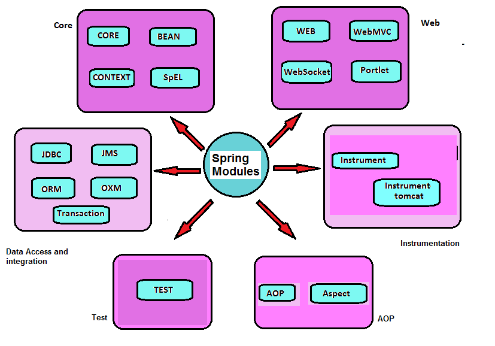

# Kiến trúc Spring

Spring có 20 modules khác nhau có thể được tóm tắt trong 7 modules chính dưới đây:

<div align="center">
    
</div>

## Core modules

### Core

Spring Core module cung cấp các cách để tạo Spring beans và ```injecting``` các phụ thuộc(dependencies) vào beans. Nó cung cấp một phương tiện để cấu hình beans và cách để lấy (obtain) các beans đã cấu hình đó. Spring container sử dụng ```BeanFactory``` và ```ApplicationContext``` để phát triển một ứng dụng standalone.

### Beans

Beans module cung cấp ```BeanFactory``` cung cấp sự thay thế cho programmatic singletons. BeanFactory module được thiết kế dựa trên *factory pattern*.

### Context

Context module kế thừa các tính năng từ beans module và hỗ trợ các tính năng Java enterprise như EJB, JMX, loading tài nguyên, và basic remoting. Nó hỗ trợ tích hợp các thư viện cho việc caching, Java Mailing và template engines như Velocity

### SpEL

**Spring Expression Language** (SpEL) module hỗ trợ việc setting, getting các giá trị thuộc tính và cấu hình các collections sử dụng các toán tử logic và toán học.

## Data access và integration modules

### JDBC (DAO)

JDBC module cung cấp một tầng abstraction trên JDBC. Nó hỗ trợ giảm boilerplate code khi getting đối tượng ```connection``` qua Driver, getting đối tượng ```Statement```, v.v. Nó cũng hỗ trợ các template như ```JdbcTemplate``` và ```HibernateTemplate``` để đơn giản hóa việc phát triển.

### ORM

**Object Relational Mapping** (ORM) module hỗ trợ tích hợp các framework phổ biến khác như Hibernate, iBATIS, **Java Persistence API** (JPA), và **Java Data Object** (JDO).

### OXM

**Object XML Mapper** (OXM) module hỗ trợ object đến ánh xạ XML và tích hợp JAXB, Castor, XStream v.v

### JMS

JMS module cung cấp cho một tầng abstract qua **Java Message Service** (JMS) cho tích hợp bất đồng bộ với các ứng dụng khác thông qua thông điệp (messaging).

### Transaction

JDBC và ORM modules xử lý trao đổi dữ liệu giữa ứng dụng Java và database. Transaction module hỗ trợ quản lý transaction trong khi làm việc với các mo-đun ORM và JDBC.

## Web MVC và remoting modules

### Web

Web module hỗ trợ tích hợp web application được tạo trong các framework khác. Sử dụng module này developers có thể lập trình các ứng dụng web sử dụng ```Servlet``` listener.

### Servlet

Servlet module chứa Spring **Module View Controller** implementation cho các ứng dụng web. 

### Porlet

Porlet module cung cấp MVC implementations được dùng trong môi trường porlet và hỗ trợ Porlet API của Java.


