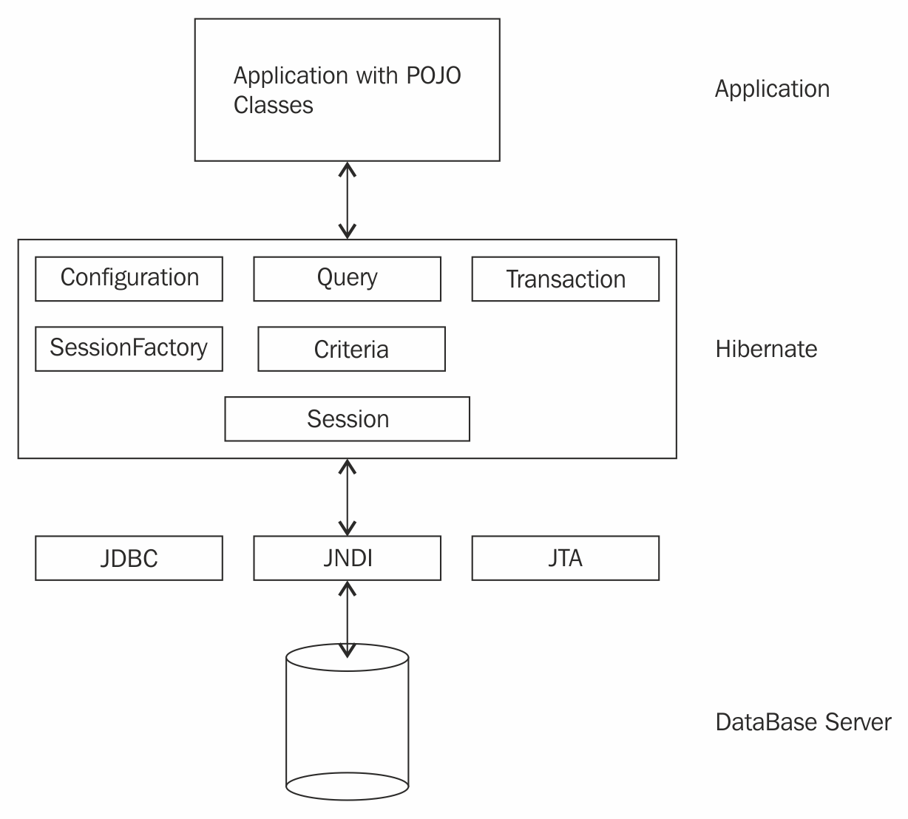

## Object relation mapping

Java is an Object Oriented Programming (OOP) language , and the database uses Structured Query Language (SQL). There are many mismatches between both. A good solution has been provided by the ORM tools.

### Hibernate

Hibernate is one of the famous middleware tools among developers for ORM solutions. It provides a solution to problems of granularity, inheritance, identity, relational association, and navigation in an easy way. The developers don't have to hard code the SQL queries, as Hibernate provides rich API to deal with CRUD database operations, making it more maintainable and easy.

#### Hibernate architecture

Hibernate has the **Session**, **SessionFactory**, **Configuration**, **Transaction**, **Query**, and **Criteria** are the interfaces at its core, which help in providing ORM support to the developers.

#### Configuration interface

Used to specify the database properties, such as URL, username and password, the location of mapping files, or a class
Used to obtain the instance of **SessionFactory**.

#### The SessionFactory interface

**SessionFactory** is used to obtain the instance of **Session**

#### Session interface

The developer creates a **Session** instance per request

#### Transaction interface

Unless the developers commit the transaction, the data won't reflect in the database.

#### Query interface

The **Query** interface provides a facility to write queries using HQL or native SQL to perform database operations. 

#### Criteria interface

The Criteria interface is similar to the Query interface--it allows the developers to write criteria query objects to get a result based on some restrictions or criteria.

> Case 1 - [Using SessionFactory](https://github.com/oceannguyen/spring-framework-note/tree/master/03-Accelerate-with-SpringDAO/ch03-03-Spring-Hibernate-Integration)

Real-time applications handle a huge amount of data at each step. Let's say we want to find a book. Using hibernate, we will simply invoke a method that returns the book depending upon the ISBN of it. In day-to-day use, the book will be searched countless times, and each time, the database will be hit, leading to performance issues. Instead of this, it will be great to have a mechanism that will use the outcome of the previous query next time someone asks for it again. 

The cache repository is the location where the objects fetched from the database will be saved in key-value pairs. 

> Case 2- [The cache configuration](https://github.com/oceannguyen/spring-framework-note/tree/master/03-Accelerate-with-SpringDAO/ch03-04-CacheManager)

