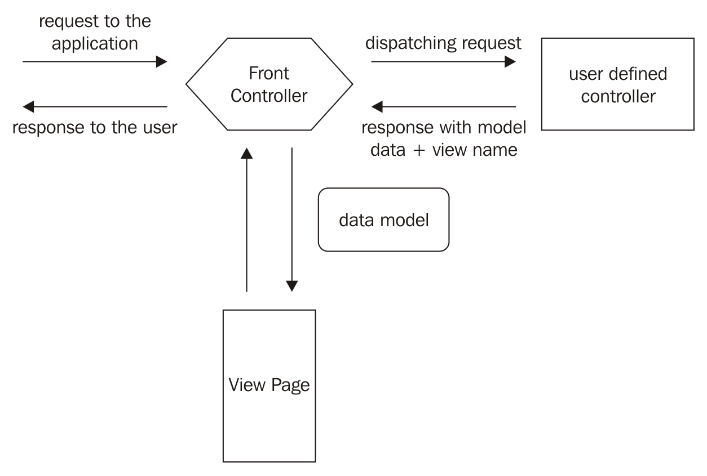
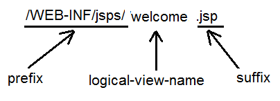

# The Spring MVC

<div algin="center"></div>

## The ViewResolver interface

To render the view

**UrlBasedViewResolver**: Ánh xạ trực tiếp các URLs đến tên view logic (logical view name). Chỉ định một tiền tố và hậu tố (prefix và suffix) để trỏ đến đúng view vật lý có tên logical view name tại ví trị tiền tố và có hậu tố theo chỉ định.
```java
<bean id="viewResolver"class= 
  "org.springframework.web.servlet.view.UrlBasedViewResolver"> 
  <property name="viewClass" value=   
    "org.springframework.web.servlet.view.JstlView"/> 
  <property name="prefix" value="WEB-INF/jsp/"/> 
  <property name="suffix" value=".jsp"/> 
<bean> 
```
**JstlView** dùng để render trang view. Trong trường hợp này là: **prefix + view_name_from_controller + suffix**

**InternalResourceViewResolver** là subclass của **UrlBasedViewResolver** cũng thực hiện render view tương tự, nó có thêm một vài thuộc tính khác.
```java
<bean id="viewResolver" class=            
 "org.springframework.web.servlet.view.InternalResourceViewResolver"> 
  <property name="viewClass" value=                
    "org.springframework.web.servlet.view.JstlView"/> 
  <property name="prefix" value="WEB-INF/jsp/"/> 
  <property name="suffix" value=".jsp"/> 
<bean> 
```
<div align="left"></div>

# A deep into Spring MVC

## @RequestMapping variants

Spring 4.3 đã bổ sung thêm một số biến thể để xử lý HTTP methods như:

- @GetMapping
- @PostMapping
- @PutMapping
- @PathMapping
- @DeleteMapping

## Case 2 - Handling form submission

Form submission là một tác vụ rất phổ biến khi phát triển ứng dụng. Với mỗi form submission developer cần thực hiện các bước sau:

- Reading request parameters.
- Converting the request parameter values according to the required data types.
- Setting the values to an object of the bean.

Những bước trên có thể lược bỏ bằng việc lấy một instance of object trên form submission. Cái mà sẽ đề cập sau đây:

- Form submission
- Form preprocessing

### Form submission

Trên form submission, các giá trị được nhập bởi người dùng có thể được bọc vào một instance của object.

```java
@RequestMapping("/showBookForm.htm") 
  public ModelAndView showBookForm(ModelMap map) 
  throws Exception { 
  Book book=new Book(); 
  map.addAttribute(book); 
  return new ModelAndView("bookForm"); 
} 
```

```html
<form:form modelAttribute="book" method="POST" 
  action="addBook.htm"> 
  <h2> 
    <center>Enter the Book Details</center> 
  </h2> 
 
  <table width="100%" height="150" align="center" border="0"> 
  <tr> 
    <td width="50%" align="right">Name of the Book</td> 
    <td width="50%" align="left"> 
      <form:input path="bookName" size="30"/> 
    </td> 
  </tr> 
  <tr> 
    <td width="50%" align="right">ISBN number</td> 
    <td width="50%" align="left"> 
      <form:input path="ISBN" size="30"/> 
    </td> 
  </tr> 
  <tr> 
    <td width="50%" align="right">Name of the Author</td> 
    <td width="50%" align="left"> 
      <form:input path="author" size="30"/> 
    </td> 
  </tr> 
  <tr> 
    <td width="50%" align="right">Price of the Book</td> 
    <td width="50%" align="left"> 
      <form:select path="price"> 
    <!--
      We will add the code to have predefined values here  
    --> 
      </form:select> 
    </td> 
  </tr> 
  <tr> 
    <!--add the code to accept description, publication as
    discussed here. You can refer the complete code from the
    link (....) 
    -->
  </tr>
  </table> 
</form:form>
```

#### Postprocessing the form

```java
@RequestMapping("/addBook.htm") 
public ModelAndView addBook(@ModelAttribute("book") Book book) 
 throws Exception { 
  ModelAndView modelAndView = new ModelAndView(); 
  modelAndView.setViewName("display"); 
  //later on the list will be fetched from the table 
  List<Book>books=new ArrayList(); 
  books.add(book); 
  modelAndView.addObject("book_list",books); 
  return modelAndView; 
} 
```
Khi người dùng submit form, các giá trị được nhập sẽ được bọc vào một instance của *Book* bằng việc annotation tham số *book* bởi ```@ModelAttribute```

#### Form preprocessing

Trong một số trường hợp, form chứa các giá trị được định nghĩa trước, ví dụ như countries hoặc book categories. Những giá trị đó có thể được hardcode dẫn đến phải thay đổi liên tục. Thay vì phải làm như vậy, Spring hỗ trợ *form preprocessing* được thực hiện trong 2 bước:

- Defining the attribute with values to add in the view
cú pháp như sau:

```html
@ModelAttribute("name_of_the_attribute") 
access_specifier return_type name_of_method(argument_list) {  // code   } 
```

```java
@ModelAttribute("hobbies") 
public List<Hobby>addAttribute() { 
  List<Hobby>hobbies=new ArrayList<Hobby>(); 
  hobbies.add(new Hobby("reading",1)); 
  hobbies.add(new Hobby("swimming",2)); 
  hobbies.add(new Hobby("dancing",3)); 
  hobbies.add(new Hobby("paining",4)); 
  return hobbies; 
} 
```

- Populating the values of the attribute in the form
cú pháp như sau:

```html
<form:name-of_tag path="name_of_data_memeber_of_bean" 
  items="name_of_attribute" itemLable="value_to display" 
  itemValue="value_it_holds"> 
```

```java
<form:checkboxes path="hobby"items="${hobbies}" 
   itemLabel="hobbyName"itemValue="hobbyId"/> 
```

### Performing Form Validation in Spring MVC

Có 2 cách tiếp cận đến validate các trường dữ liệu form trong Spring MVC:
- JSR-303 specification-based validation
- Spring-based implementation using the Validator interface

#### Custom validator based on Spring Validator interface

Spring cung cấp interface **Validator** có một phương thức validate để kiểm tra các fields. Interface này không hỗ trợ mỗi validate của web tier mà còn có thể dùng trong bất ký tier nào để validate dữ liệu.

Trong trường hợp nếu có lỗi xảy ra user sẽ biết được bằng việc hiển thị messages thông báo. **BindingResult** là lớp con của **Errors** giữ các kết quả validation bọc bởi Errors khi thực hiện validation trên model trong phương thức ```validate()```. Messages được bọc để thông báo lỗi sẽ được hiển thị sử dụng tag ```<form:errors>``` trong view.
Refer to [Ch06_ReadMyBooks](/Ch06_ReadMyBooks)

#### JSR annotation-based validation

JSR 303 là một bean specification định nghĩa metadata và APIs để validate dữ liệu trong các ứng dụng J2EE.
Dưới đây là những annotations thường được sử dụng:

| Annotations | Description |
| --- | --- |
| @NotNull | This checks whether the annotated value is not null, but it cannot check for empty strings|
| @Null | This checks whether the annotated value is null |
| @Pattern | This checks whether the annotated string matches the given regular expression or not |
| @Past | This checks whether the annotated value is a date in the past |
| @Future | This checks whether the annotated value is a date in the future |
| @Min | This makes sure that the annotated element is a number whose value is equal to or greater than the specified value |
| @Max | This makes sure that the annotated element is a number whose value is equal to or less than the specified value |
| @AssertFalse | This ensures that the annotated element is false |
| @AssertTrue | This ensures that the annotated element is true |
| @Size | This ensures that the annotated element is between the maximum and minimum values |

Những annotations được cung cấp bởi Hibernate Validator:
| Annotations | Description |
| --- | --- |
| @CreditCardNumber | This checks that the annotated value follows the character sequence passed to it |
| @Email | This is used to check whether the specified character follows a valid e-mail address according to the specified expression |
| @Length | This checks whether the annotated element has a number of characters limited by the minimum and maximum attributes specified by the annotation |
| @NotBlank | This checks for the annotated element that is not null, and has a length greater than zero |
| @NotEmpty | This makes sure that the annotated element is neither null nor empty |