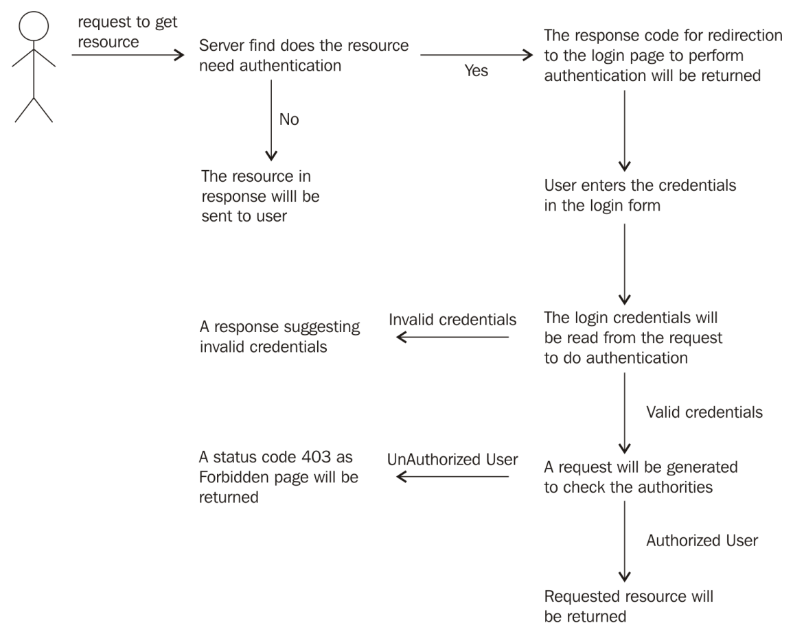

## 1. Core components of Spring Security

### 1.1. SecurityContextHolder

One major aspect of security is storing the information of the principal currently used by the application. It is held by the security context of the application.

> The principal is the user who has currently logged in to the application.

### 1.2. Authentication 

To store the information about the principal, Spring Security uses the object of *Authentication*. The following piece of code demonstrates how to get the *SecurityContext* object and get the principal used:

```
SecurityContextHolder context = SecurityContextHolder.getContext(); 
Authentication auth= context.getAuthentication(); 
Object appl_principal=auth.getPrincipal(); 
```

### 1.3. UserDetailsService

*UserDetailsService* is another core interface in the Spring Security framework that is used to retrieve data related to the user. This obtained information is stored in *UserDeatails*, which represents the principal. We can get the user information as shown in the following lines of code:

```
if(appl_principal instance of UserDetails) 
{ 
  String username=((UserDetails)app_principal).getUsername(); 
} 
```

### 1.4. GrantedAuthority

How will we get the information about which role the users are holding? *GrantedAuthority* is the answer.

*GrantedAuthority* provides information about the authority granted to the principal. The object of *GrantedAuthority* will be obtained from the instance of *Authentication* using the *getAuthorities()* method.

### 1.5. AuthenticationManager

The *AuthenticationManager* interface facilitates authenticating the requests

## 2. Configuring AuthenticationManager

Sử dụng ```AuthenticationManager``` để cung cấp thông tin về các roles gán cho các users, được thực hiện như sau:
```java,xml
<security:authentication-manager>
    <security:authentication-provider>
        <security:user-service>
            <security:user name="user1" password="user1"
                authorities="ROLE_USER" />
            <security:user name="user2" password="user2"
                authorities="ROLE_USER, ROLE_ADMIN" />
            <security:user name="admin" password="admin"
                authorities="ROLE_ADMIN" />
        </security:user-service>
    </security:authentication-provider>
</security:authentication-manager>
```
### 2.1. Adding security

Chỉ định resources ta muốn giới hạn truy cập thông qua:
* Thêm filter mapping cho ```DelegatingFilterProxy``` là một ```filter``` trong web.xml
```java
<filter>
    <filter-name>springSecurityFilterChain</filter-name>
    <filter-class>org.springframework.web.filter.DelegatingFilterProxy</filter-class>
</filter>
<filter-mapping>
    <filter-name>springSecurityFilterChain</filter-name>
    <url-pattern>/*</url-pattern>
</filter-mapping>
```
* Tạo file *spring-security.xml* trong thư mục ```WEB-INF``` để ánh xạ các ràng buộc security
* Thêm basic ```<http``` element sau:
```java
<security:http> 
  <security:intercept-url pattern="/data.htm"
    access="hasRole('ROLE_USER')" /> 
  <security:http-basic /> 
</security:http>
```

Vì có nhiều file config được sử dụng trong Spring context, phải thêm ```contextConfigLocation``` để chỉ định danh sách các files được sử dụng để khởi tạo
```java,xml
<servlet> 
    <servlet-name>security</servlet-name> 
    <servlet-class> 
       org.springframework.web.servlet.DispatcherServlet 
        </servlet-class> 
    <init-param> 
      <param-name>contextConfigLocation</param-name> 
      <param-value>WEB-INF/security-servlet.xml WEB-INF/spring-security.xml</param-value> 
    </init-param> 
    <load-on-startup>1</load-on-startup> 
</servlet> 
 
<context-param> 
    <param-name>contextConfigLocation</param-name> 
    <param-value>WEB-INF/security-servlet.xml WEB-INF/spring-security.xml</param-value> 
</context-param> 
<listener> 
    <listener-class>     
      org.springframework.web.context.ContextLoaderListener 
    </listener-class> 
</listener> 
```
Luồng của ứng dụng được được thực hiện như sau:
<div align="center">
    
</div>

Trên đây đã sử dụng ```basic authentication``` cho ta thấy phương hướng để add security vào trong ứng dụng như thế nào. Nhưng ta có thể tùy chỉnh được form đăng nhập không? Sau khi đăng nhập thành công/lỗi cần phải forward người dùng tới trang nào? Vì vậy tiếp sau đây sẽ giới thiệu về ```form-based authentication``` cho phép ta tùy chỉnh trang đăng nhập và một số luồng liên quan.

- Để config theo ```form-based authentication``` ta update cấu hình như đã trình bày như sau:
```java,xml
<security:http> 
    <security:intercept-url pattern="/data.htm" 
      access="hasRole('ROLE_USER')" /> 
    <security:form-login login-page="/mylogin.htm" 
      authentication-failure-url="/error.htm" /> 
    <security:csrf disabled="true"/> 
</security:http>
```
Trong đó:

> Trang login sẽ được trả về là ```mylogin.htm```

> Trường hợp login sai trang sẽ trả về với url ```error.htm```

> ```csrf```: **cross-site request forgery** (CSRF) là disabled để ngăn chặn lỗ hổng tấn công dựa trên mượn quyền đăng nhập

- Tiếp theo update ```controller``` như sau:
```java,xml
@RequestMapping("/mylogin.htm") 
public ModelAndView login() 
{ 
  return new ModelAndView("login"); 
} 

@RequestMapping("/error.htm") 
public ModelAndView login_fail() 
{ 
  return new ModelAndView("login","error","please provide correct credentials"); 
} 
```

- View trang ```login.jsp```:
```html
<form action="<c:url value='/login'/>" method="post"> 
    <table align="center"> 
       <tr style="height: 50px"> 
          <td align="left">User Name</td> 
          <td><input type="text" name="username" value=""></td> 
        </tr> 
        <tr> 
           <td align="left">Password</td> 
           <td><input type="password" name="password"></td> 
        </tr> 
        <tr> 
           <td></td> 
           <td align="right"><input type="submit"   
                value="LOGIN"></td> 
        </tr> 
     </table> 
</form> 
<center> 
   <font color="red" style="font-style: italic; font-size: large;"> 
      <c:out value="${error}"></c:out> 
    </font> 
</center> 
```

Spring hỗ trợ nhiều các providers xác thực bên thứ 3 (third-party authentication provider) như ```LDAP``` và ```CAS```. ```UserDetailsService``` được sử dụng để tìm kiếm ```username```, ```password``` và ```GrantAuthoritieS```, được thực hiện qua việc so sánh username và password có được từ UsernamePasswordAuthenticationToken với username và password được load trong ```UserDetailsService```. Spring cung 2 implementation cho xác thực:

> **In-memory authentication**

> **JDBC authentication**

### 2.2. In-memory authentication

Tiện lợi trong trường hợp developers không muốn lãng phí thời gian cấu hình database. Được thực hiện như sau:
```java
<user-service id="userDetailsService"> 
   <user name="abc" password="abc" authorities="ROLE_ADMIN" /> 
   <user name="xyz" password="xyz" authorities="ROLE_USER,ROLE_ADMIN" /> 
</user-service> 
```
Ngoài ra ta cũng có thể thực hiện tải các credentials và roles từ một file ```external properties```.
```
<user-service id="userDetailsService"   
  properties="myusers.properties"/> 
```
```myusers.properties``` định nghĩa theo cấu trúc sau:
```
username=password,grantedAuthority[,grantedAuthority][,enabled|disabled] 
```
```
abc=abc,ROLE_USER,enabled 
xyz=xyz,ROLE_USER,ROLE_ADMIN,enabled 
```

### 2.3. The JDBC authentication

Spring security hỗ trợ việc sử dụng ```UserDetailsService``` để đọc thông tin xác thực từ database tables sử dụng Spring-JDBC. Sau đây kịch bản cấu hình đơn giản:

* Đầu tiên, cần tạo bảng quan hệ:
```sql
CREATE TABLE users ( 
   username VARCHAR(50) NOT NULL PRIMARY KEY, 
   password VARCHAR(50) NOT NULL, 
   enabled BIT NOT NULL 
); 

CREATE TABLE authorities ( 
   username VARCHAR(50) NOT NULL, 
   authority VARCHAR(50) NOT NULL 
); 
ALTER TABLE authorities ADD CONSTRAINT fk_authorities_users foreign key
 (username) REFERENCES users(username); 
```
* Tiếp theo ta cần cấu hình bean cho ```UserDetailsService```
```xml
<bean id="userDetailsService" class=     
  "org.springframework.security.core.userdetails.jdbc.JdbcDaoImpl"> 
    <property name="dataSource" ref="dataSource"/> 
</bean> 
```

### 2.4. The Remember-Me authentication

Trong một kịch bản websites cần nhớ identity của người dùng giữa các sessions. Việc này có thực hiện bằng việc add tính năng **remember-me**. Mặc định, Spring cho phép thêm tính năng ```remember-me``` qua việc thêm ```token``` dựa trên ```cookies``` đến ```response```. ```remember-me cookie``` được add phía client, chứa các dữ liệu sau:
* **username**: This is to identify the logged-in principal.
* **expirationTime**: This is the time until the cookie will be available. The default is 2 weeks.
* **MD5 hash**: This contains a combination of username and expirationTime, plus the password and the predefined key.

Cấu hình ```remember-me``` được chỉ định theo:
```xml
<security:remember-me remember-me-parameter="some_valid_name" 
  token-validity-seconds="validity_in_seconds"
  data-source-ref="if_for_dataSource_bean"_> 
</security:remember-me> 
```
Trong đó:

* **remember-me-parameter**: Tên thuộc tính trong ```checkbox``` input.
* **token-validity-seconds**: Thời gian mà ```remember-me``` cookie tồn tại, tính theo đơn vị giây.
* **data-source-ref**: Thuộc tính này được sử dụng trong trường hợp ta muốn lưu trữ thông tin trong database. *By default, the simple hash-based token approach is cookie-based*.

- Update trong tag ```<http>``` như sau:
```
<security:remember-me remember-me-parameter="rem-me"> 
</security:remember-me> 
```

- Update ```login.jsp```
```html
<tr> 
  <td></td> 
  <td align="left">Remember ME<input type="checkbox"                
    name="rem-me"></td> 
</tr> 
```
Tham khảo [video](https://www.youtube.com/watch?v=9HgREWvDsYk) này để hiểu rõ về chức năng remember-me

### 2.5. Logout

Standard configuration để cấu hình logout trong ```<http>``` như sau:
```java
<security:logout logout-success-url="name_of_page_to_redirect"  
  delete-cookies="delete_cookies_or_not"  
  invalidate-session="invalidate_the_session_or_not"/> 
```
Trong đó:
* **logout-success-url**: Tên trang sẽ chuyển user tới
* **delete-cookies**:  Chỉ định giá trị để xóa cookies đã được lưu phía client khi loggout.
* **invalidate-session**: This is the attribute used to invalidate the session after logging out

### 2.6. Managing the Session

Người dùng có thể truy cập bao nhiêu phiên làm việc cùng một lúc với tài khoản của họ? Spring Session management cung cấp tính năng giúp 'ngăn' việc người dùng chia sẻ tài khoản của họ để truy cập cho nhiều nơi.

Spring session management và ```HttpSession``` có điểm gì khác nhau:
* **Problems handling multiple accounts**: Thông thường, chúng ta thường có nhiều hơn 1 account, một dùng cho cá nhân và một dùng cho văn phòng. Khi sử dụng ```HttpSession``` để kiểm tra user có đang đăng nhập hay không, user phải logout từ tài khoản và sau đó đăng nhập vào tài khoản khác nữa. Do vậy Spring Framework cho phép chúng ta cấu hình nhiều sessions cho mỗi user mà ko phải loggout từ một tài khoản rồi lại đăng nhập vào tài khoản khác.

* **Multiple sessions per login**: Quản lý phiên theo truyền thống (```HttpSession```) với tài khoản người dùng khó để duy trì nhiều roles. Người dùng phải login vào tài khoản khác để sử dụng role mong muốn.

* **Accessing session data**: Spring cung cấp các APIs cho phép lấy thông tin phiên làm việc dựa trên ID của phiên.

### 2.7. Working of the Spring session

Sử dụng session để lưu trữ dữ liệu thế nào một cách hiệu quả và tin cậy thế nào?
Làm sao để nhận biết rằng phiên làm việc người dùng có liên kết với ```request``` hay nói cách khác ```user``` đó quyền truy cập đến *incomming request* không?

* **The data store**: Spring không định nghĩa cụ thể các *underlying data store* thay vào đó cung cấp các interfaces cho phép developer implementation. Những interfaces cung cấp để hỗ trợ lưu trữ dữ liệu là: ```Session```, ```ExpiringSession``` và ```SessionRepository```

* **The session determination**: Luôn được liên kết với ```request``` để biết phiên làm việc nào được liên kết với *upcoming request* nào

Spring cung cấp Spring-related configuration để quản lý một phiên trong các phiên bản khác nhau:

> **Session creation**: Có thể cấu hình như sau:

```java
<http create-session="XXX"> 
```

Thuộc tính ```create-session``` có thể là các giá trị sau:

| Value of the attribute | What action to take regarding the session? |
| --- | --- |
| Always | In case of no preexisted session, a session always be created |
| ifRequired | A new session will be created only if required |
| Stateless | Spring Security will not create as well use a session |
| Never | If a preexisted session is available, it will be used; however, if no session is available explicitly, a new session will not be created |

> **Concurrent session management**: Đôi khi, developers cần dừng việc tạo nhiều hơn một phiên với mỗi người dùng. Ta có thể cấu hình như sau:

```xml
<session-management> 
   <concurrency-control 
      max-sessions="1" error-if-maximum-exceeded="false" /> 
</session-management> 
```

### 2.8. Method-level security

Spring Framework cùng tạo thuận lợi trong việc security ở mức các phương thức

### @Secured

```java
    @Secured({"ROLE_ADMIN","ROLE_USER"}) 
    public String message() 
    { 
      //code goes here 
    } 
```
Có nghĩa rằng chỉ user có quyền được chỉ định mới được truy cập tới phương thức

### 2.9. @PreAuthorize and @PostAuthorize

```java
    @PreAuthorize("hasRole('ROLE_ADMIN')") 
    public String message() 
    { 
       //code goes here 
    } 
```
Chức năng tương tự như ```@Secure``` nhưng ```@PreAuthorize``` và ```@PostAuthorize``` có thể sử dụng cùng với các biểu thức. Có một chút khác biệt với ```@PostAuthorize``` ```annotation``` là kiểm tra quyền sau khi thực hiện phương thức, VD: những bản ghi được tạo bởi ```UserA``` thì chỉ có ```UserA``` được quyền chỉnh sửa

```java
public interface UserService {
 
    List<User> findAllUsers();
 
    @PostAuthorize ("returnObject.type == authentication.name")
    User findById(int id);
 
    @PreAuthorize("hasRole('ADMIN')")
    void updateUser(User user);
     
    @PreAuthorize("hasRole('ADMIN') AND hasRole('DBA')")
    void deleteUser(int id);
 
}
```

| Expression to use | When to use |
| --- | --- |
| hasRole(name_of the_role) | This is used to specify the role that can access the method. |
| hasAnyRole(role1, role2) | This is used to specify multiple roles that can invoke the method. |
| permitAll | This will allow all the users to invoke the method. |
| denyAll | This will deny all the users to invoke the method. |
| isRememberMe() | This is used to determine whether the user is a remember-me user. | 
| isAuthenticated() | This is used to determine whether the user is anonymous or not. | 
| hasPermission(target_object, permission_object) | This expression evaluates that the target object has the specified permissions whether to invoke the method or not. | 

## HttpSecurity

```java
protected void configure(HttpSecurity http) throws Exception {
	http
		.authorizeRequests()
			.anyRequest().authenticated()
			.and()
		.formLogin()
			.and()
		.httpBasic();
}
```

## Java Configuration and Form Login

```java
protected void configure(HttpSecurity http) throws Exception {
	http
		.authorizeRequests()
			.anyRequest().authenticated()
			.and()
		.formLogin()
			.loginPage("/login")
			.permitAll();   
}
```

##  Authorize Requests

```java
protected void configure(HttpSecurity http) throws Exception {
	http
		.authorizeRequests()                                                                
			.antMatchers("/resources/**", "/signup", "/about").permitAll()                  
			.antMatchers("/admin/**").hasRole("ADMIN")                                      
			.antMatchers("/db/**").access("hasRole('ADMIN') and hasRole('DBA')")            
			.anyRequest().authenticated()                                                   
			.and()
		// ...
		.formLogin();
}
```

## Handling Logouts

```java
protected void configure(HttpSecurity http) throws Exception {
	http
		.logout()                                                                
			.logoutUrl("/my/logout")                                                 
			.logoutSuccessUrl("/my/index")                                           
			.logoutSuccessHandler(logoutSuccessHandler)                              
			.invalidateHttpSession(true)                                             
			.addLogoutHandler(logoutHandler)                                        
			.deleteCookies(cookieNamesToClear)                                       
			.and()
		...
}
```

###  LogoutHandler

Generally, LogoutHandler implementations indicate classes that are able to participate in logout handling. They are expected to be invoked to perform necessary clean-up.

For example: clearing remember me

### LogoutSuccessHandler

he LogoutSuccessHandler is called after a successful logout by the LogoutFilter, to handle e.g. redirection or forwarding to the appropriate destination.
